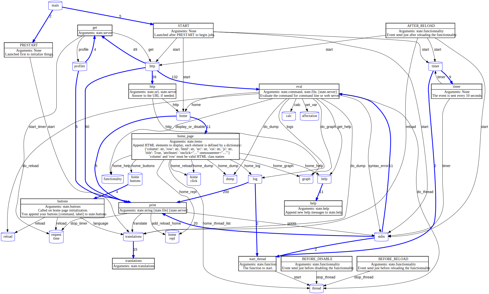

# Programming by functionality using synchronous events

## Preamble

The core idea:

   * One file per functionality so adding or removing a functionality
     only change one file.

   * Functionalities communicate using synchronous events.

   * When an event is launched it is dispatched to all the handlers
     of this event type.

   * The event handler has a state parameter.
     This state can be used and modified by any event handler.

   * Functionalities add their handlers to event types.

   * Functionalities send events. They can define the initial state of the event.

   * Sending an event returns the return value of the last called handler.
     It is possible because events are synchronous.

   * Each handler has a priority, they are called in the order.
     So a functionality can add a low priority handle to an event type
     and a high priority one to another.
    
   * If an handler does not returns None then the other handlers
     will not be called and the value will be returned to
     the event sender.

   * The information flow can be of any kind when an event is sent:

       * From the sender to receivers.
       * From the receivers to the sender.
       * From a receiver to a later called one.
       * A receiver can modify the information defined by a previous one.
       * A mix of all above.

   * Introspection is possible at the event level.

   * A minimalist framework (100 Python lines).

```
               send event type
Functionality  --------------> dispatcher ---> handler 1 returns None
                                          ---> handler 2 returns None
               <------------------------------ handler 3 returns a value
```

The calling graph can be displayed on the web page (if `graphviz` is installed)

## Why create something new?

It is not as plugins (as in firefox application) because:

  * Plugins modify the application behavior,
    they can not mutualy modify their behavior.
  
  * Plugins must adhere to an API defined by the application,
    they usualy not extend this API.

It is not as Javascript events:

  * The handlers call order is not defined.
    JQuery library fix this but the order is the order of creation,
    so it is not easy to define.

  * The events are readonly, handlers can not modify them to add
    or modify data.

  * The events can not return a value.

It is not function hooks (there are many function hook types in Emacs) because:

  * The primary function is special,
    defining it is required before adding hooks to it.

  * The API is fixed by the primary function,
    adding a new parameter is not possible without updating all the code.

## Application overview

It is easy to write a functionality to profile and display the call graph
of the running application.



Legend:

   * Cylinder: a file, each one defines a functionality.

   * Rectangle: an event type

   * Blue arcs: functionality sending an event.
     The number indicates the number of events sent.

   * Black arcs: event dispatching to functionalities.
     The label is the function name called in the functionality file.

Some arcs are not displayed for clarity : `_help` `_translations` `_counter` `_record`
in fact all the function names starting by `_`.
All the functionalities receive `translations` events,
it is really not useful to display it.

## Documentation

To launch demo:  `./main.py`

Only one import needed : `from reactor import R`

The main program defines the application full state as a global variable
usable by any functionality.
Concurrent modification of R.M is not thread safe: so protect it.
Do not use R.M is it is possible to use event parameters.

```python
class MyModel:
    my_data = 2024
R.M = MyModel()
```

Sending an event :

```python
answer = R('event-type', attr1=value, attr2=value...)
# 'answer' is None if no event handler managed the event
#          or the data returned by the last event handler called
```

Add a new event receiver, handlers are called by priority (Abricot before Zombi).
The state is created clean from the attribute values defined when calling
and the handlers may change the attribute values or add new ones.
The caller can define any attributes, they are not checked.

```python
@R.handler('event-type','OPTIONAL_PRIORIY_AS_A_STRING')
def function_name(state):
    """
    state.event contains the event type
    Other state attributes (as state.foo) depends on the event type
    and are initialized by the caller or by previous event handlers.
    """
    return "Any data to stop event processing"
    return None # To let over handlers analyse the event
```

Add a optional description to the event type:
```python
R.description('PRESTART', "No arguments, launched first")
```

Event types are not defined, their usage defines their attributes.
Theses are some of the event type defined in the example application:

```python
R('PRESTART')                        # Initialisation of the functionalities
R('START')                           # Start the functionalities
R('print', string=, wfile=)          # Print something
R('eval', command=, wfile=, server=) # file and server are needed for live log
R('translations', translations=)     # Get translation list
R('help', help=)                     # Get help message
R('get', server=)                    # request analyser (in order to be stackable)
R('http', server=)                   # send HTTP header if not default
R('buttons', buttons=)               # append tuple ('url', 'label') to add HTML buttons
R('timer')                           # Event send every 10 seconds
```

To see the full list, use `pr` on command line.

To add a new button for a new functionality on the home page or command line,
do not modify `FUNCTIONALITIES/home.py` but create `FUNCTIONALITIES/xxx.py`

```python
@R.handler('eval')
def do_XXX(state):
    """If XXX command: do it"""
    if state.command != 'XXX':
        return None
    # Do XXX

@R.handler('buttons', 'W') # W to be before Reload (Z)
def xxx(state):
    """Add XXX button on home page"""
    state.buttons.append(('/XXX', '[[[XXX_button]]]'))

@R.handler('help', 'Z')
def print_help(state):
    "help for command line"
    state.help.append('  XXX : [[[XXX_button]]]')

@R.handler('translations')
def translations(state):
    "Translations"
    state.translations['en']['XXX_button'] = "Functionality XXX"
    state.translations['fr']['XXX_button'] = "Fonctionalité XXX"
```
